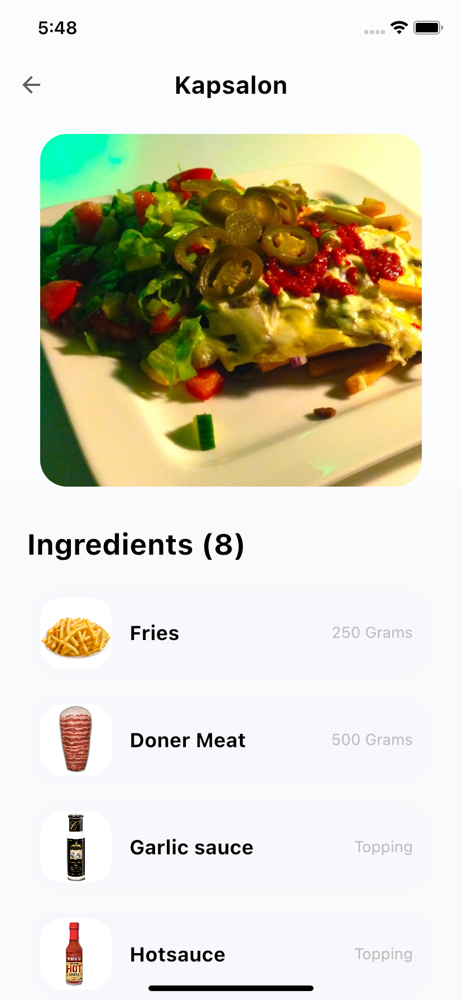

# MealBook

This app allows you to find best recipe for cooking

<table>
  <tr>
    <td>Gif</td>
    <td>Intro screen</td>
    <td>Home screen</td>
    <td>Recipe screen</td>
  </tr>
  <tr>
    <td></td>
    <td></td>
    <td></td>
    <td></td>
  </tr>
 </table>

## Start

This project uses Flutter 2 with Null Safety enabled.

Kotlin for Android and Swift for iOS are chosen as the native part.

1. Clone the repository.
2. Delete the .git folder
3. Initialize git and bind the project repository

```bash
rm -rf .git
git init
git remote add origin git@github.com:username/new_repo

flutter pub get
flutter pub run build_runner build
```


### Environment
  
All fields in the environment are added via a new config or an existing one. An example of a config in a template:  
  
```dart  
import 'package:mealbook/common/env/debug_options.dart';
import 'package:mealbook/common/logger/logger.dart';

class Config {
  Config({
    required this.logger,
    required this.debugOptions,
    required this.apiBaseUrl,
  });

  final Logger logger;
  final DebugOptions debugOptions;
  final String apiBaseUrl;
}
```  
  
Initialization happens at the beginning, in main with the corresponding env postfix.  
  
Example:  
  
```dart
Environment.init(
    buildType: BuildType.dev,
    config: Config(
      logger: devLogger(),
      debugOptions: DebugOptions(),
      apiBaseUrl: 'https://www.themealdb.com/api/json/v1/1/',
    ),
  );
```  
  
Example read from Env:  
  
``Available everywhere, since Environment is Singleton.``  
  
```dart  
Environment<Config>.instance().config.title  
```


### Launching an application
  
We have two environments: dev and production. Then the file structure should be as follows:  

**Production - main.dart**

Run:   
```bash  
flutter run -t lib/main.dart  
```  
  
**Dev - main_dev.dart**

Run:   
```bash  
flutter run -t lib/main_dev.dart  
```  
  
**Important:**
Each file must include configuration specific to the environment. It is allowed to declare it only in these files.
