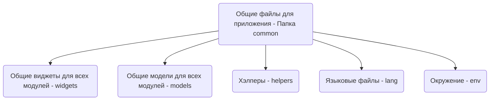
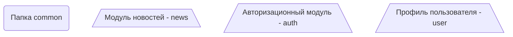
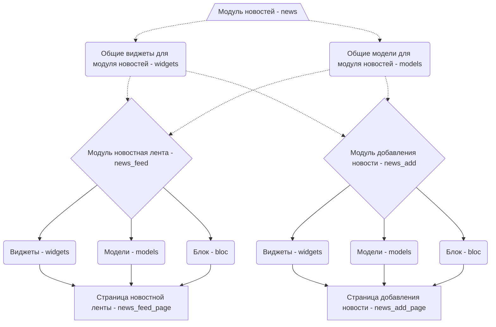

# Архитектура

Важные ссылки для ознакомления:
1. [Документация Flutter Bloc](https://bloclibrary.dev/#/gettingstarted)
1. [Naming convention](https://bloclibrary.dev/#/blocnamingconventions)

В данном шаблоне используется менеджер состояний Bloc с несколькими изменениями:
1. Мы не используем слой провайдеров, провайдеры и используются только репозитории.
1. Мы не используем Mocktail, используем подход с Mockito и кодогенерацией
1. Не делаем один блок на несколько страниц, для обмена данными между блоками используем репозитории или передача через конструктор
1. Исключение для блоков на несколько страниц - обработчик ошибок и другие заранее оговоренные кейсы

По структуре мы стараемся дробить функционал на логические блоки и преследуем цель - на одну страницу, один блок.

# Структура
Для понимания структуры стоит разобрать пример с построением небольшого новостного приложения:
1. Новостной модуль
    1. Страница новостной ленты
    1. Страница добавления новости
1. Авторизационный модуль
    1. Страница авторизации
1. Профиль пользователя
    1. Страница профиля
    2. Избранные новости

**Структура общих модулей для всего приложения:**

**Верхняя логика модулей в приложении:**

**Новостной модуль:**

[![](https://mermaid.ink/img/eyJjb2RlIjoiZ3JhcGggVERcblxuTU5bL9Cc0L7QtNGD0LvRjCDQvdC-0LLQvtGB0YLQtdC5IC0gbmV3c1xcXVxuTkZ70JzQvtC00YPQu9GMINC90L7QstC-0YHRgtC90LDRjyDQu9C10L3RgtCwIC0gbmV3c19mZWVkfVxuTkZBe9Cc0L7QtNGD0LvRjCDQtNC-0LHQsNCy0LvQtdC90LjRjyDQvdC-0LLQvtGB0YLQuCAtIG5ld3NfYWRkfVxuXG5NTlco0J7QsdGJ0LjQtSDQstC40LTQttC10YLRiyDQtNC70Y8g0LzQvtC00YPQu9GPINC90L7QstC-0YHRgtC10LkgLSB3aWRnZXRzKVxuXG5NTk0o0J7QsdGJ0LjQtSDQvNC-0LTQtdC70Lgg0LTQu9GPINC80L7QtNGD0LvRjyDQvdC-0LLQvtGB0YLQtdC5IC0gbW9kZWxzKVxuXG5NTiAtLi0-IE1OV1xuXG5NTiAtLi0-IE1OTVxuXG5NTlcgLS4tPiBORlxuXG5NTk0gLS4tPiBORlxuXG5NTlcgLS4tPiBORkFcblxuTU5NIC0uLT4gTkZBXG5cbk5GIC0tPiBORlco0JLQuNC00LbQtdGC0YsgLSB3aWRnZXRzKVxuXG5ORiAtLT4gTkZNKNCc0L7QtNC10LvQuCAtIG1vZGVscylcblxuTkYgLS0-IE5GQijQkdC70L7QuiAtIGJsb2MpXG5cbk5GVyAtLT4gTkZQXG5cbk5GTSAtLT4gTkZQXG5cbk5GQiAtLT4gTkZQXG5cbk5GUFvQodGC0YDQsNC90LjRhtCwINC90L7QstC-0YHRgtC90L7QuSDQu9C10L3RgtGLIC0gbmV3c19mZWVkX3BhZ2VdXG5cbk5GQSAtLT4gTkZBVyjQktC40LTQttC10YLRiyAtIHdpZGdldHMpXG5cbk5GQSAtLT4gTkZBTSjQnNC-0LTQtdC70LggLSBtb2RlbHMpXG5cbk5GQSAtLT4gTkZBQijQkdC70L7QuiAtIGJsb2MpXG5cbk5GQVcgLS0-IE5GQVBcblxuTkZBTSAtLT4gTkZBUFxuXG5ORkFCIC0tPiBORkFQXG5cbk5GQVBb0KHRgtGA0LDQvdC40YbQsCDQtNC-0LHQsNCy0LvQtdC90LjRjyDQvdC-0LLQvtGB0YLQuCAtIG5ld3NfYWRkX3BhZ2VdXG4iLCJtZXJtYWlkIjp7InRoZW1lIjoiZGVmYXVsdCJ9LCJ1cGRhdGVFZGl0b3IiOmZhbHNlLCJhdXRvU3luYyI6dHJ1ZSwidXBkYXRlRGlhZ3JhbSI6ZmFsc2V9)](https://mermaid-js.github.io/mermaid-live-editor/edit##eyJjb2RlIjoiZ3JhcGggVERcblxuQ09NKNCe0LHRidC40LUg0YTQsNC50LvRiyDQtNC70Y8g0L_RgNC40LvQvtC20LXQvdC40Y8gLSDQn9Cw0L_QutCwINGBb21tb24pXG5cbk1OVyjQntCx0YnQuNC1INCy0LjQtNC20LXRgtGLINC00LvRjyDQstGB0LXRhSDQvNC-0LTRg9C70LXQuSAtIHdpZGdldHMpXG5NTk0o0J7QsdGJ0LjQtSDQvNC-0LTQtdC70Lgg0LTQu9GPINCy0YHQtdGFINC80L7QtNGD0LvQtdC5IC0gbW9kZWxzKVxuSExQKNCl0Y3Qu9C_0LXRgNGLIC0gaGVscGVycylcbkxORyjQr9C30YvQutC-0LLRi9C1INGE0LDQudC70YsgLSBsYW5nKVxuRU5WKNCe0LrRgNGD0LbQtdC90LjQtSAtIGVudilcblxuQ09NIC0tPiBNTldcbkNPTSAtLT4gTU5NXG5DT00gLS0-IEhMUFxuQ09NIC0tPiBMTkdcbkNPTSAtLT4gRU5WIiwibWVybWFpZCI6IntcbiAgXCJ0aGVtZVwiOiBcImRlZmF1bHRcIlxufSIsInVwZGF0ZUVkaXRvciI6ZmFsc2UsImF1dG9TeW5jIjp0cnVlLCJ1cGRhdGVEaWFncmFtIjpmYWxzZX0)

